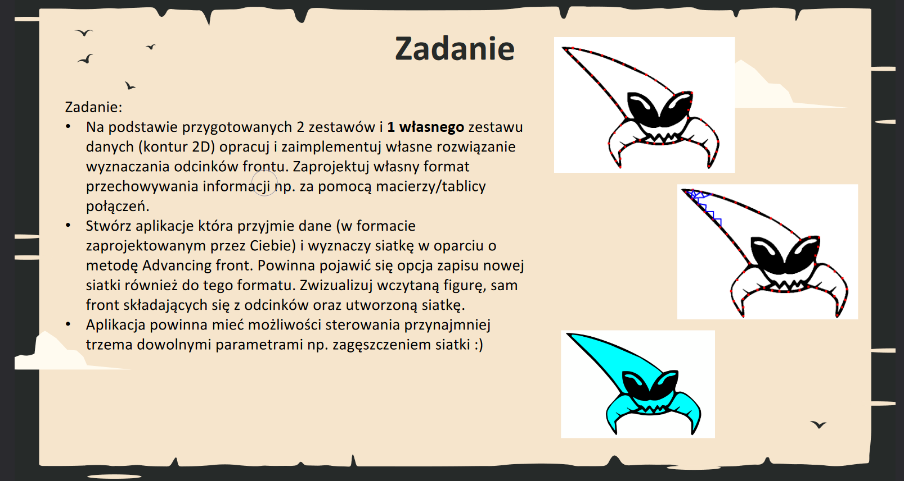
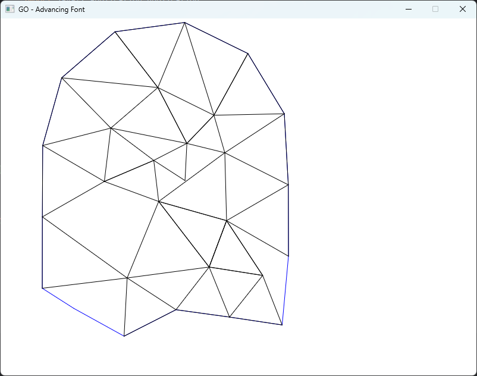
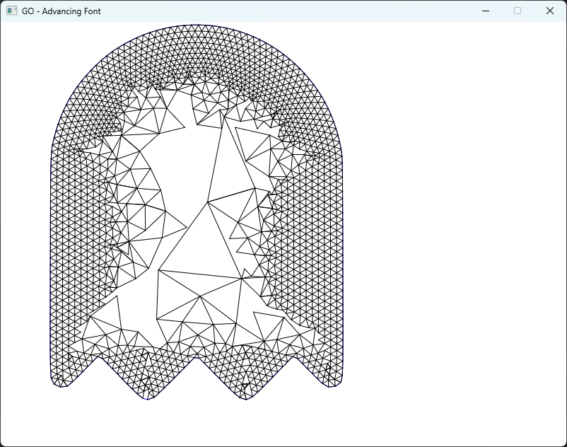
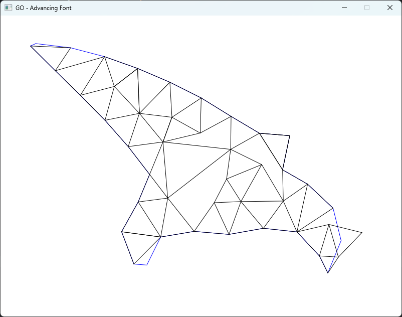
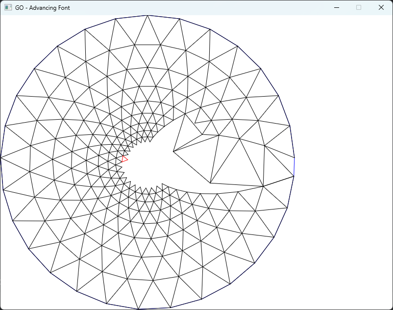
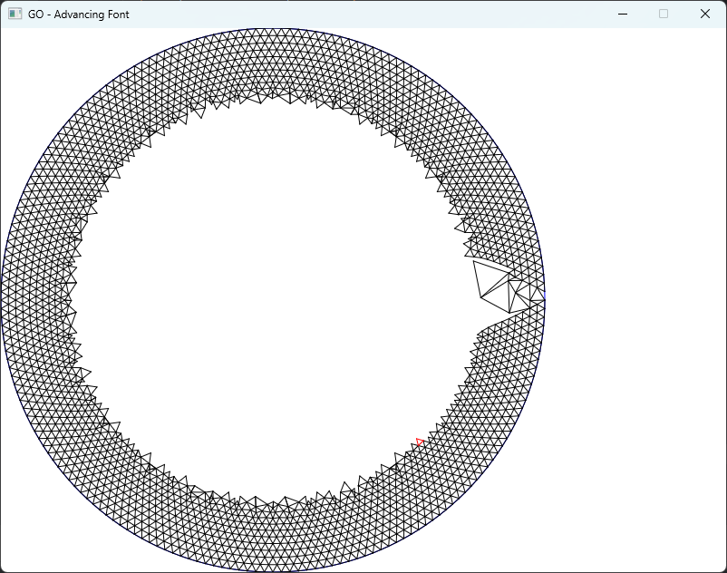

  

Poniżej przedstawiono wynik działania obecnej wersji programu dla 3 zestawów punktów w różnych konfiguracjach (zagęszczenie, ilość wygenerowanych elementów). Program jest w trakcie budowy i nie został ukończony.

  
  
  
  
  
    Czerwony element jest ostatnim wygenerowanym elementem (do debugowania).
  

